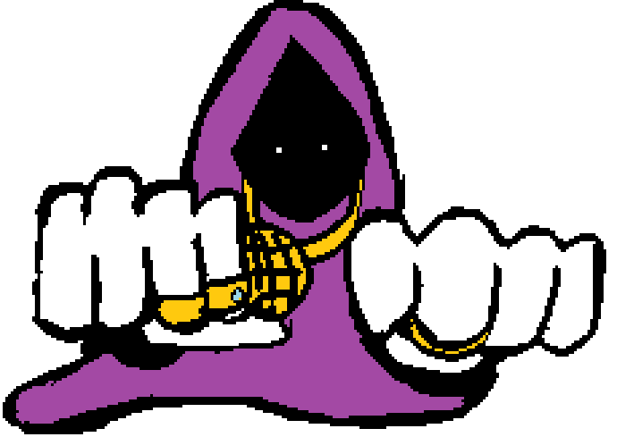

## Wssup

Just a tech.

## Skills & Technologies

  
  
  
  
  

## Top Projects

- [marcgispert11.github.io](https://github.com/marcgispert11/marcgispert11.github.io)  
  A personal website showcasing my projects and skills.  
  ⭐️ 0 stars | Language: HTML  
  Forks: 0 | Open Issues: 0

- [cyber_m01uf2](https://github.com/marcgispert11/cyber_m01uf2)  
  Exercise repository for Cybersecurity Systems (2024-2025).  
  ⭐️ 0 stars | Language: Shell  
  Forks: 0 | Open Issues: 0

- [RepasoC-](https://github.com/marcgispert11/RepasoC-)  
  Repository containing all C++ exercises done in class.  
  ⭐️ 0 stars | Language: C++  
  Forks: 0 | Open Issues: 0

- [Repas_SQLi](https://github.com/marcgispert11/Repas_SQLi)  
  A collection of SQL injection exercises.  
  ⭐️ 0 stars | Language: C++  
  Forks: 0 | Open Issues: 0

- [Exercicis-Rep-s-C-](https://github.com/marcgispert11/Exercicis-Rep-s-C-)  
  This repository collects C++ exercises done in class and at home.  
  ⭐️ 0 stars | Language: C++  
  Forks: 0 | Open Issues: 0

## GitHub Stats

🔭 I have **9** public repositories.  
👥 I am following **3** users.  
👥 I have **2** followers.  

## Gotta feed the snake!

